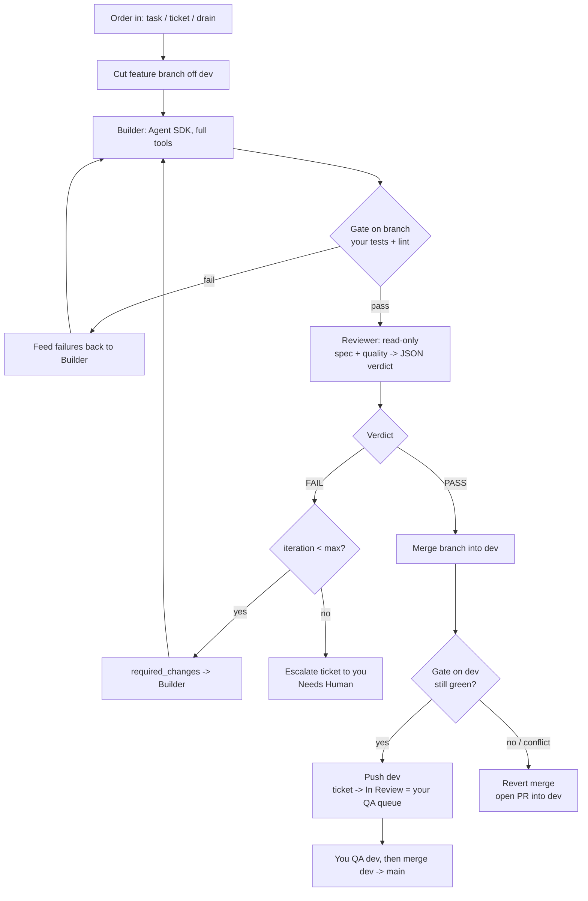

# The General — Architecture

An unattended dev unit. The **General** (orchestrator) commands two officers — the
**Builder** (Claude Code via the Agent SDK) and the **Reviewer** (a second,
read-only Claude) — to implement work across your apps, and lands passing changes
on each app's `dev` branch while keeping dev green. You command `dev → main`.

## Chain of command

- **You + Claude Chat = the architect.** You decide what to build and write the
  ticket / acceptance criteria (in words, or in Jira).
- **The General = orchestrator.** Owns git, the Definition of Done, iteration
  bounds, the cost budget, every backlog transition, and the keep-dev-green merge.
- **The Builder = officer.** Full tools, writes code on a feature branch.
- **The Reviewer = officer.** Read-only; judges the diff on spec + quality and
  returns the next order.

This automates your original loop: in your first sketch, Claude Chat analysed each
build and handed back "the next prompt." The **Reviewer is that role**, automated —
its `required_changes` become the Builder's next prompt, so build↔review iterates
with no copy-paste from you.

## Why the separation

Generator–critic separation. The Builder has full repo context and a "make it
work" bias and must not grade its own homework. The Reviewer gets fresh eyes and a
read-only sandbox, so it cannot rationalise a change by editing it. The failure
mode we engineer against is the **telephone game** (lossy hand-offs + drift),
countered by three rules:

1. **The ticket is the source of truth, not chat.** Every loop re-anchors on the
   ticket (summary + description + acceptance criteria).
2. **The diff is the unit of review.** "What did the Builder do" = `git diff`.
3. **Hand-offs are structured packets**, not prose — see Data Contracts.

## The loop



`main` never appears as a write target above — by design.

## Keeping dev green

When several features land on dev unattended, each can pass alone yet break on
integration. So after merging a feature into dev the General re-runs that app's
gate **on dev**:

- green → push dev; the ticket enters your QA queue (`In Review`).
- red or merge conflict → the merge is reverted locally (dev is never pushed
  broken) and a **PR into dev** is opened for you instead.

In dry-run this is a *trial*: it performs the merge locally, runs the dev gate to
predict the outcome, then reverts — so you see "would merge / would open PR"
without any side effect.

## Intake (three modes)

`intake.py` turns an order into a worklist of `(app, ticket)`:

- **task** — free text → an ephemeral ticket (no tracker). For quick bugs.
- **ticket** — one or more Jira keys → fetched via the backlog adapter.
- **drain** — pull ready tickets (status + `autodev` label) for one app or all.

Ephemeral tickets skip all backlog writes; everything else updates Jira.

## Data contracts

**Build request → Builder**
```
{ ticket{id, summary, description, acceptance_criteria[]}, branch, prior_issues[]?, iteration }
```

**Reviewer verdict → General** (strict JSON the Reviewer must emit)
```
{ verdict: "PASS"|"FAIL",
  spec_conformance: { met: bool, gaps: [str] },
  quality: { issues: [ {severity:"blocker"|"major"|"minor", area, detail} ] },
  required_changes: [str],
  summary: str }
```
Ship-ready ⇔ `verdict==PASS` AND `spec_conformance.met` AND no blocker/major issues.
Anything else is a FAIL and `required_changes` becomes the Builder's next order.

## Outcomes

| Outcome | Meaning |
|---------|---------|
| `merged_to_dev` | Passed review, merged, dev stayed green (live) |
| `pr_into_dev` | Passed review but couldn't merge safely → PR for you |
| `escalated` | Hit max_iterations or budget → Needs Human |
| `errored` | Builder/infra failure or no changes produced |
| `skipped` | Dry-run (includes the trial-merge prediction in its note) |

## Stopping conditions & safety

- `max_iterations` per ticket, then escalate.
- `max_cost_usd` budget across the run (summed `ResultMessage.total_cost_usd`).
- **`main` is code-protected** — `git_ops` refuses to checkout/commit/merge it.
- **Reviewer read-only** enforced via `disallowed_tools`, not prompt alone.
- **dry-run preview** via `dry_run: true` in config.yaml (the code default is live); secrets from env only; full JSONL audit log.

## Components

| File | Responsibility |
|------|----------------|
| `main.py` | CLI: task / ticket / drain / doctor |
| `loop.py` | build → gate → review → land-on-dev / retry / escalate |
| `builder.py` | Builder officer (Agent SDK, full tools) |
| `reviewer.py` | Reviewer officer (Agent SDK, read-only, structured verdict) |
| `agent.py` | shared Agent SDK runner |
| `gate.py` | runs an app's tests/lint (branch, then dev) |
| `git_ops.py` | branch / diff / keep-green merge / PR; protects main |
| `intake.py` | task / ticket / drain → worklist |
| `contracts.py` | hand-off dataclasses |
| `config.py` | apps + global settings + env secrets |
| `audit.py` | JSONL audit log |
| `backlog/` | `base` interface, `jira` (primary), `notion` (stub), `none` |
