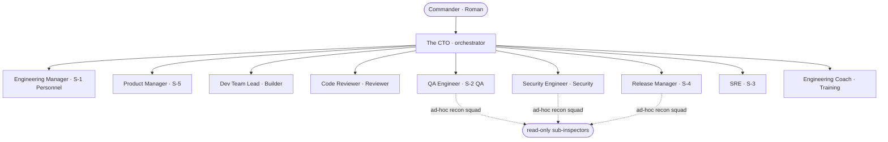
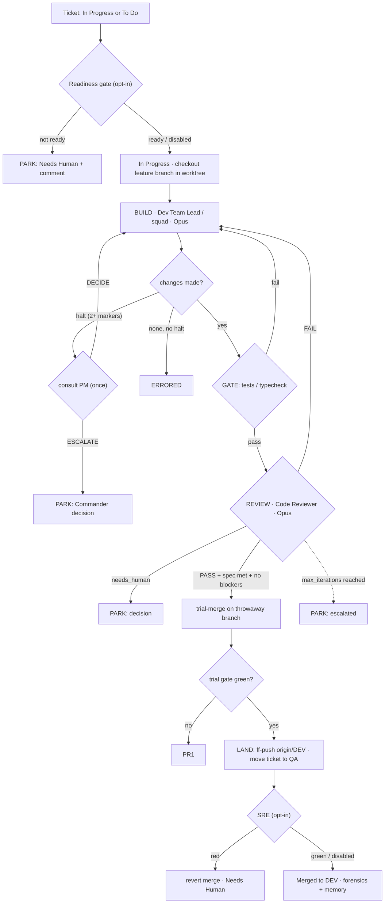
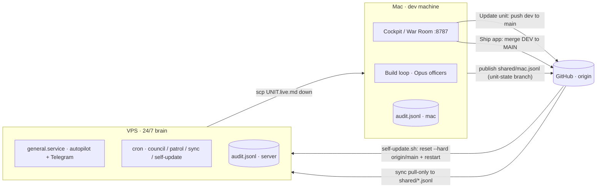

# The CTO (Elite Unit) — System Overview

> A from-zero reference for the autonomous software-delivery unit in this repo.
> Every claim below is grounded in the code with `file:line` citations. Anything I could not
> verify in code is marked **(inferred)**. Accurate over comprehensive.
>
> _Written against branch `dev`, 2026-06-21. The runtime posture section reflects the live
> `config.yaml`; defaults come from `orchestrator/config.py`._

---

## 1. What it is — the mental model

**The CTO** is an autonomous unit that pulls the Commander's Jira tickets and implements them
end-to-end — build → gate → review → security → land on **DEV** → move to **QA** — using a team of
Claude-Agent-SDK "officer" agents, and **never touches MAIN autonomously** (`memory/UNIT.md` mission,
`orchestrator/memory.py:43-46`; enforced in `orchestrator/git_ops.py`).

- The **Commander** is Roman — the human in command. He owns the DEV → MAIN promotion.
- The **CTO** is the orchestrator: the Python loop that owns git, the iteration bounds, the
  cost budget, every backlog transition, and the keep-DEV-green merge (`orchestrator/loop.py:1-6`),
  *plus* the chair of the daily council (`orchestrator/council.py`).

The officers are individual Claude Code (Agent SDK) runs, each given a role-specific system prompt,
a model, an effort tier, and a tool allow/deny list. A single helper — `agent.run_agent`
(`orchestrator/agent.py:46`) — is the one choke-point every officer call passes through (so token
burn is metered in one place, `agent.py:86-91`).

Two surfaces drive it: a local Flask **cockpit / War Room** (`orchestrator/server.py`) on the Mac, and
an always-on **autopilot** daemon (`orchestrator/autopilot.py`) on a VPS. Telegram is the two-way
remote control (`orchestrator/notify.py`, `orchestrator/decisions.py`).

---

## 2. The cast — officers, engineers, and recon squads

### Officers

The council roster is defined in `orchestrator/council.py:59-101`; duties + model mapping in
`orchestrator/roster.py:19-40`. **Model is always Opus for implementation** (`config.py:92-93`);
council/chat discussion runs on Sonnet (`discussion_model`, `config.py:98`) and the cheap tier
(roster status line, notify distillation) on Haiku (`smalltalk_model`, `config.py:99`).

| Officer (army name) | Staff role | What it does | When invoked | Model · effort | Input → Output |
|---|---|---|---|---|---|
| **The CTO** | Orchestrator | Owns git + the loop; chairs the council; talks 1:1 with the Commander | Always (the loop) + every council/chat | Loop = Python; chair = Sonnet (`council.py:312-316`) | worklist → `TicketReport`s; briefings |
| **Dev Team Lead** | Builder | Implements one ticket **solo** on the feature branch (the build-delegation squad was deleted — Phase-2 §2; `builder.py:497-505`) | Step 1 of every build iteration (`loop.py:329`) | **Opus** (`builder_model`) · sized XS→`low`…`high`, escalates on retry (`builder.py:140-156`) | `BuildRequest` → `BuildResult` (`contracts.py:46-61`) |
| **Code Reviewer** | Reviewer | Adversarial read-only review of the diff: spec conformance + quality | Step 3 of every iteration (`loop.py:412`) | **Opus** (`reviewer_model`) · `reviewer_effort`=high, read-only (`reviewer.py:84-97`) | diff+ticket → `ReviewResult` (PASS/FAIL, issues, `needs_human`) |
| **Product Manager** | S-5 · Product | Decides the everyday product/IA calls so the build resumes; escalates only critical/irreversible ones | On a deliberate Builder halt (`loop.py:291-304, 347-371`) | **Opus** (`reviewer_model`) · effort high (`pm.py:98-104`) | halt report → `{verdict: DECIDE\|ESCALATE, body}` |
| **SRE** | S-3 · Integration & rollback | Runs the heavier post-merge suite on landed DEV; forward-only `git revert` if red | After a live merge, if `should_run` (`loop.py:547-549`, `sentinel.py:18-20`) | **No model** — deterministic (`sentinel.py`) | `postmerge_commands` → green / reverted |
| **QA Engineer** | S-2 · Recon / QA | Smoke-tests the *running* app on DEV (flows + a11y); files findings as tickets | `scout` CLI, `scout_after_merge` (`loop.py:582-597`), patrol | **Opus** (`reviewer_model`, `scout.py:57`) — note ⚠ below | app → recon report (+filed tickets) |
| **Security Engineer (recon)** | Security | Full security recon of recent DEV changes | `provost` CLI, patrol (`provost.py:53-63`) | **Opus** (`reviewer_model`) | DEV → security report |
| **Release Manager** | S-4 · Deploy readiness | Certifies DEV can ship to MAIN (build/types/migrations/deps/env) | `quartermaster` CLI, patrol, ship-review (`quartermaster.py:52-62`) | **Opus** (`reviewer_model`) | DEV → READY/NOT-READY report |
| **Engineering Manager** | S-1 · Personnel (HR) | Proposes hires/retirements of officers — **propose-only**; you approve | Daily-council seat only (`council.py:63-68`; the `adjutant` CLI + `adjutant.py` were deleted — EU-325/EU-326) | **Sonnet** (`discussion_model` council seat, `council.py:268`; roster row `roster.py:36-38`) | record → at most one personnel recommendation in the council briefing |
| **Engineering Coach** | Doctrine & Training | Names recurring weaknesses and proposes ONE drill (a precise officer-charter edit) — **propose-only**; the apply machinery is gone | Daily-council seat only (`council.py:99-104`; `drillmaster.py` + the `drill` CLI were deleted — EU-327; its doctrine backup lives on as `doctrine.snapshot_doctrine`, EU-331) | **Sonnet** (`discussion_model` council seat, `council.py:268`) | signals → one proposed drill in the council briefing |
| **Technical Writer** | (memory keeper) | Rewrites the Lessons & Decisions log after a council | After each council (`council.py:334-337`, `memory.scribe`) | **Sonnet** (`discussion_model`, `memory.py:221`), read-only | council+audit → `UNIT.live.md` bullets |

> ⚠ **Doc-vs-code drift to know:** `roster.py:30-35` lists QA Engineer / Security Engineer / Release Manager under
> `discussion_model` (Sonnet), but their dedicated *recon* runs actually use `reviewer_model` (Opus)
> — `scout.py:57`, `provost.py:62`, `quartermaster.py:60`. When these three merely *speak* in a council
> they run on Sonnet (`council.py:204-215`); when they *inspect*, they run on Opus. The cast table
> above reflects the verified recon model.

### The build squad is RETIRED — the Builder builds solo

The Dev Team Lead's build-delegation path (squad-lead planner + soldiers + ephemeral-specialist
synthesis, and `hr.py` with it) was **deleted** in the Phase-2 §2 flag-off collapse (2026-07-06);
the final residual was stripped by EU-326. The Builder always builds solo now (`builder.py:497-505`;
`squad.py:1-11` records the collapse). What remains in `squad.py` is the standing **lane map** —
the engineer-lane vocabulary (`SQUAD`, `squad.py:15-21`: Frontend Engineer · Ordnance BE ·
Logistics DB · DevOps · Software Engineer) — not a dispatchable squad. `delegation_enabled` now
arms **only** the recon squads below (`config.py:249-253`).

### The recon officers' ad-hoc read-only squads (`orchestrator/recon.py`)

The one delegation mechanism still standing. When delegation is armed, QA Engineer / Security Engineer / Release Manager
each decide *for themselves* (a cheap read-only planning pass) whether to recruit read-only
sub-inspectors for a big surface or run solo; < 2 slices ⇒ solo (`recon.py:130-147`). Engineers are
read-only and sequential; the lead synthesizes one report in the officer's own format
(`recon.py:160-196`).

### Chain of command

---

## 3. The ticket lifecycle (the core flow)

Driven by `orchestrator/loop.py`. Per ticket: `process_ticket` (`loop.py:252`) → `_attempt`
(`loop.py:307`) loops up to `max_iterations` (default 4, `config.py:145`) → `_land` (`loop.py:487`).

**Step by step:**

1. **Intake.** A worklist of `(AppConfig, Ticket)` pairs is built by `orchestrator/intake.py`
   (free-text → ephemeral ticket; Jira keys; or drain). `run()` (`loop.py:185`) takes an exclusive
   **`flock` worktree lock per app** for the whole run (`loop.py:196-207`); a busy app's tickets are
   **deferred**, never clobbered (`loop.py:218-222`).
2. **Readiness gate** *(owner: `readiness.py`, opt-in `readiness_gate`, off in live config)*. A ticket
   with no acceptance criteria **and** a thin description is handed back before any build —
   status → Needs Human + comment, parked decision (`loop.py:259-275`). **PARK.**
3. **Branch.** Status → In Progress; `git.checkout_feature(branch)` creates the feature branch off
   `origin/<base>` in the isolated worktree (`loop.py:277-279`, `git_ops.py:100-112`).
4. **Build** *(owner: Dev Team Lead / squad, Opus)*. Effort is sized from the ticket and escalates on
   retry (`loop.py:324`, `builder.py:140-156`). If the builder errors → **ERRORED** (`loop.py:336-338`).
   If it made **no changes**: a "deliberate halt" (≥ 2 halt markers, `loop.py:53-63`) routes to the
   **PM** once (`loop.py:347-371`) — `DECIDE` injects the decision and rebuilds; `ESCALATE` **PARKs**.
   No changes without halt language → **ERRORED** (`loop.py:389-391`).
5. **Gate** *(owner: `gate.py`)*. Runs the app's `gate_commands` in the worktree (`loop.py:398`,
   `gate.py:41-44`). **Fail → back to the builder** with the failure as feedback (`loop.py:400-404`).
   ⚠ With no `gate_commands` the gate trivially passes (`gate.py:42-44`); the live app's gate is
   typecheck-only (`config.yaml:52`).
6. **Review** *(owner: Code Reviewer, Opus, read-only)*. Judges the staged diff (`loop.py:411-412`).
   - `needs_human=true` → record a decision + **PARK** (`loop.py:434-443`).
   - Not ship-ready (`verdict!=PASS`, spec gap, or blocker/major issue — `contracts.py:101-106`) →
     **retry** with `required_changes` (`loop.py:469-473`).
   - **Ship-ready** → continue.
   *(Phase-2 §2, 2026-07-06: the LLM per-diff Security gate that used to run here was deleted —
   secret/dep checks are deterministic in `gate.py` now, and the weekly `provost` recon still runs.)*
7. **Land** *(owner: `git_ops.py`)*. `_land` (`loop.py:487`) commits, then **trial-merges on a throwaway
   branch** and re-runs the gate on it — DEV is never touched until validated (`loop.py:497-498`). If
   clean+green+not-blocked → `land_trial` **ff-pushes `origin/<base>`** (the one moment DEV changes,
   `git_ops.py:215-229`), retires the feature branch, and `sync_main_base` brings the Mac's local DEV
   up to date for QA (`loop.py:519-523`). Otherwise → **PR into DEV** (`loop.py:562-579`). In dry-run,
   the trial is abandoned and nothing lands (`loop.py:509-516`).
9. **Move to QA.** On a live merge the ticket goes to **QA** (or **Done** if `mark_done_on_merge`),
   with a test link, plus Telegram (`loop.py:530-543`).
10. **SRE** *(owner: `sentinel.py`, opt-in, off in live config)*. If armed + `postmerge_commands`,
    runs the heavier suite on landed DEV; red → forward-only revert + Needs Human (`loop.py:545-556`).
11. **Forensics + memory.** After every ticket, `forensics.maybe_postmortem` writes a post-mortem once a
    ticket has failed `postmortem_after` times (`loop.py:242-246`, `forensics.py:171-189`). Memory is
    folded by the Technical Writer after each council (`council.py:334-337`).

**Outcomes** (`contracts.py:112-117`): `MERGED`, `PR_OPENED`, `ESCALATED` (parked / hit caps),
`ERRORED` (builder/infra failure), `SKIPPED` (dry-run / stopped / deferred).

---

## 4. How work gets triggered

1. **Manual — the cockpit** (`server.py`):
   - **Choose a ticket** → `/tickets` lists assigned tickets → `/api/run-selected` (`server.py:608`).
   - **+ New task** (Feature/Bug, optional screenshot) → `/api/run` (`server.py:651`).
   - **Needs-you → Ship answer** → `/api/answer` (`server.py:1717`): resolves a parked decision and
     re-runs the ticket, or comments + unblocks if none pending.
   - **Patrol** → `/api/patrol` (`server.py:999`); **Ship review** → `/api/ship-review` (`server.py:916`).
   - **Autopilot Start/Stop** → `/api/autopilot` (`server.py:491`).
2. **Continuous — autopilot drain** (`autopilot.py:74`): resume In Progress, else take top To Do →
   build → land → QA, loop. Parks escalated/errored/PR tickets in `blocked_tickets.json`
   (`autopilot.py:29, 145-150`).
3. **Telegram** (`decisions.handle_command`, `decisions.py:129`): `/run <app> <what>`, `/drain`,
   `/unblock <id>`, `/council`, `/standup`, `/status`, `/help`; a `TICKET: decision` reply
   resumes a parked ticket (`decisions.handle_reply`, `decisions.py:100`); any other free-text goes to
   the CTO as 1:1 chat (`decisions.route_message`, `decisions.py:199`).
4. **Scheduled — VPS cron** (`scripts/install-server-cron.sh`; all times UTC — the box clock is
   Etc/UTC and Ubuntu cron ignores CRON_TZ, EU-432): self-update every 15 min, state sync every
   15 min, a LIGHT daily stand-up (`general daily`) at 05:30 UTC (= 08:30 Asia/Jerusalem), and a
   WEEKLY deep council (`general council`) Mon 06:30 UTC (= 09:30). sync/daily/council run through
   `general cron-guard` (timestamps + rotates `council/cron.log`, alerts Telegram on repeated
   failure). patrol and the SWE-bench builder are NOT scheduled here (no real product target / host
   never builds). The Mac launchd scheduler is **retired** — the VPS cron is the single source.

---

## 5. The cockpit (War Room)

`general serve` → `server.serve` binds **localhost only** (`server.py:1817-1839`); runs happen in
background threads so the page stays responsive. Live progress is captured by tee-ing stdout into a
ring buffer (`server.py:46-64`) and pushed to the browser via Server-Sent Events (`server.py:529-552`).

**Panels** (rendered by `orchestrator/warroom.py`, control bar by `server._control_bar`):
- **Active run + phase bar** — the current ticket and `✓ Build ✓ Gate ⏳ Review ○ Land` checklist
  (`loop._bar`, `loop.py:99-108`).
- **Live feed** — the unit's stdout stream.
- **Activity** — recent steps (collapsible).
- **Needs-you** (`/needs`, `server.py:1074`) — questions from the CTO, officer recommendations to
  approve, and runs that need you; **badge** count from `needs.count` (`server.py:160-165`).
- **Talk-to-the-unit** — `/chat` (1:1 with the CTO, `server.py:1626`) and `/group` (the whole unit,
  `server.py:1648`).

**Action buttons** (`server._control_bar`, `server.py:142-367`):
| Button | Endpoint | What it does |
|---|---|---|
| Choose a ticket | `/tickets` → `/api/run-selected` | Pick assigned tickets and develop them |
| + New task | `/api/run` | Free-text feature/bug (optional screenshot) |
| Patrol | `/api/patrol` | QA Engineer + Security Engineer + Release Manager sweep DEV and **file** Jira tickets |
| Ship review | `/api/ship-review` | Release Manager certifies + officers debate → GO/NO-GO (advisory) |
| Jira | `/jira` | Pick/quick-connect the Jira a project uses |
| + Product | `/onboard` | Scaffold a new product into `config.yaml` |
| **Update unit** | `/api/promote` | Promote **The CTO's own** code dev → main; the VPS self-updates |
| **Ship → production** | `/ship-preview` → `/api/ship-main` | Ship an **app's** DEV → MAIN (production) |
| Autopilot Start/Stop | `/api/autopilot` | Toggle the continuous drain |

> "Update unit" vs "Ship" are deliberately distinct (`server.py:167-216`): the first deploys *this
> tool*; the second deploys *your product*. Both appear only when `GENERAL_COCKPIT_PROMOTE=1`
> (`sync.can_promote`, `sync.py:238-242`).

**Reports pages:** Token usage (`/usage`, `server.py:1166`), Failure forensics (`/forensics`,
`server.py:1492`), Unit roster (`/roster-doc`, `server.py:1552`), Unit memory (`/memory`,
`server.py:839`), Daily muster & meetings (`/council`), Task log (`/tasks`). (The
`/approvals` single-report page was removed in the 2026-07-19 stabilization — its KINDS
registry had been permanently empty since EU-325/EU-327; ticket-proposal batches render
in `/needs`.)

A **health gate** blocks runs until green: `health.summary` (`health.py:81`) checks Claude login, the
Agent SDK, git, gh, Telegram, and per-app repo/branch/gate/worktree/Jira (`health.py:34-78`). Run
buttons short-circuit with a banner if unhealthy (`server.py:617-619, 656-658`).

---

## 6. Decisions & the human-in-the-loop

- **PM decides vs escalates** (`pm.py:69-85`): the verdict is parsed from a trailing
  `PM VERDICT: DECIDE|ESCALATE` line; an unclear reply **fails safe to ESCALATE**. In **automode**
  (`auto_mode`, off in live config) ESCALATE is coerced to DECIDE so the unit never stops
  (`pm.py:82-83`); the autonomous decision is left as a durable Jira comment for review (`loop.py:359-365`).
- **A parked decision** is stored in `pending_decisions.json` (`decisions.add`, `decisions.py:46-56`),
  surfaced in the **Needs-you** box and pushed to **Telegram** with `Reply TICKET: <decision>`
  (`loop.py:435-437`).
- **Your answer resumes the ticket** (`decisions.handle_reply`, `decisions.py:100-115`): the pending
  decision is popped, the ticket is rebuilt with `"Commander's decision on the open question: …"`
  appended to its description (`decisions.to_worklist`, `decisions.py:76-86`), and re-run. Resume is a
  fresh run with the answer baked in — there are no long-lived paused threads.
- From the cockpit, **Ship answer** (`/api/answer`) does the same, and if no decision is pending it
  posts the answer as a Jira comment and `/unblock`s the ticket so autopilot retries it
  (`server.py:1717-1759`).

---

## 7. Safety & invariants — what's enforced, and how

| Invariant | Enforced by | Could it bypass? |
|---|---|---|
| **Never lands on MAIN autonomously** | `AppConfig.validate` rejects base==protected (`config.py:76-78`); `Git.__init__` same (`git_ops.py:21`); `_guard` + `merge_no_ff` + `land_trial` all refuse the protected branch (`git_ops.py:55-57, 142, 219`); the autonomous land only ff-pushes `origin/<base>` i.e. DEV (`git_ops.py:222`). | **No** for the loop/autopilot/Telegram. The **only** MAIN pushes are the cockpit buttons `sync.promote` (the CTO's own dev→main) and `sync.promote_app` (an app's DEV→MAIN) — both gated by `can_promote()` and human-confirmed (`sync.py:261-291, 336-382`). |
| **Isolated git worktrees** | Each app runs in a dedicated linked worktree on a detached `origin/<base>` (`use_worktree`, on in live config; `git_ops.setup`, `git_ops.py:60-84`; `loop._make_git`, `loop.py:119-139`). An exclusive `flock` per app stops two runs resetting each other's tree (`loop.py:158-207`). | Falls back to in-tree only if `origin/<base>` can't resolve (`loop.py:134-137`). |
| **Tool-call guardrail** | A `PreToolUse` hook on every write-capable officer (`guard.hooks_config`, wired in `builder.py:540`, `recon.py:100`) denies, in code, writes to secret paths and a denylist of destructive shell (`guard.py:23-65`). | **Best-effort denylist, not a sandbox.** See §7.1. |
| **Readiness gate** | Deterministic check hands back under-specified tickets before any build (`readiness.assess`, `readiness.py:12-28`). | Opt-in; **off** in live config. |
| **Cost / token governor + auto-pause** | Autopilot checks `usage.budget_status` each cycle and pauses when over the daily ceiling (`autopilot.py:104-120`). | Armed when `daily_token_budget > 0`; **armed by default** (`100_000_000` tokens/day, `config.py:131`) so a runaway loop auto-pauses — tune to your Max headroom (`usage.py:120-134`). The in-loop USD `Budget` is still a no-op on the Max plan (`max_cost_usd: 0`). |

### 7.1 What the guardrail can and cannot stop

The Builder runs `permission_mode="bypassPermissions"` with `setting_sources=[]`, so the repo's own
`ask/deny` rules don't apply — the guard hook is the only code-level boundary (`builder.py:226-236`).
The guard is honest about being a **denylist that fails open** for anything it doesn't recognise
(`guard.py:13-16`):

- It blocks **writes** to `.env*`, keys, `.git/`, `.github/`, `secrets.*` (`guard.py:23-30, 53-59`) and a
  fixed set of destructive shell patterns: `rm -rf` of `/ ~ $HOME ..`, force-push, push to `main/master`,
  `reset --hard`, `clean -f`, `DROP/TRUNCATE`, `chmod 777`, fork bomb, `curl|sh` (`guard.py:33-44`).
- It does **not** stop reading `.env` and exfiltrating it (e.g. `curl --data @.env`), `rm -rf` of an
  absolute project path, or write-script-then-run patterns — these match nothing in the denylist. The
  real boundary against a prompt-injected ticket is **worktree isolation + read-only reviewer +
  never-touch-MAIN**, not the guard.

> Note: `git_ops.py` and `sync.py` perform git directly in Python (subprocess), **not** through an agent
> tool — so the guard hook does not apply to them, which is why the never-MAIN invariant lives in
> `git_ops`'s own logic, not the guard.

---

## 8. Learning & memory

**Unit Memory** (`orchestrator/memory.py`) is two files:
- `memory/UNIT.md` — **versioned doctrine**: Mission, Standing Orders, Per-App Notes. Commander-owned;
  ships via git (`memory.py:27`). Only the region between `<!-- SCRIBE:BEGIN -->`/`END` is machine-written.
- `memory/UNIT.live.md` — the **gitignored living log** (Lessons & Decisions). Officer-maintained; it
  survives the VPS `git reset --hard` self-update because it's untracked (`memory.py:28, 143-152`;
  `.gitignore`).

`memory.preamble()` prepends both to **every** officer's system prompt (`memory.py:115-123`), so the
whole unit shares one memory.

**The Technical Writer** (`memory.scribe`, `memory.py:172-256`) is a read-only Sonnet agent that, after each
council, proposes new log bullets from the latest transcript + recent audit; **Python** does the
marker-bounded write (deterministic, safe).

**Consolidation + learning-from-rejections** (`orchestrator/consolidate.py`) — deterministic, no model
(`consolidate.py:139-167`): it dedups/prunes the log, and scans the Reviewer's `FAIL` verdicts in the
audit; when the same *theme* (tenant isolation, missing tests, typing, error handling, validation,
security, naming/lint, docs — `consolidate.py:24-49`) recurs across ≥ `min_count` tickets, it folds a
one-line lesson into the log. Runs automatically after every productive autopilot cycle and after
every scribe run; `./general consolidate` is the manual entry point. (The `/memory` rejection panel
and Consolidate button were removed 2026-07-19 — the panel was an all-time aggregate no click could
clear, and its "drill candidate" framing referred to the drillmaster deleted in EU-327.)

**Failure forensics** (`orchestrator/forensics.py`) — deterministic taxonomy of failure causes
(`_RULES`, `forensics.py:29-55`), repeat offenders (`forensics.py:104-116`), and **auto post-mortems**:
after a ticket has failed `postmortem_after` (default 3) times, `maybe_postmortem` writes
`postmortems/<TICKET>.md` with a pattern, timeline, dominant cause, and the fix (`forensics.py:135-189`).

**The daily roster doc** (`orchestrator/roster.py`) regenerates `ROSTER.md` after each council: a
deterministic chain-of-command + officer/engineer tables (read from code so it can't drift), plus one
cheap Haiku status line (`roster.py:165-198`).

---

## 9. Cost & models

**Tiers / ceilings** (`config.py:104-123`):
- **Opus** (`claude-opus-4-8`) — the configured *ceiling* for `builder_model` (Builder + engineers +
  council round-table) and `reviewer_model` (Reviewer + the PM/QA/Security/Release/Engineering-Manager/
  Engineering-Coach recon). With the ladder **on**, Opus is the cap these roles may climb to, not their
  starting tier — see below.
- **Sonnet** (`claude-sonnet-4-6`, `discussion_model`) — councils, stand-up, group chat, the CTO's
  chair/1:1, the Technical Writer. Also the **floor for all code** (Builder / Reviewer / recon
  sub-inspectors never drop below Sonnet — a too-weak coder just fails review and burns more on retries).
- **Haiku** (`claude-haiku-4-5-20251001`, `smalltalk_model`) — the cheap-model tier for the roster
  status line and notification distillation. **Pinned** — never routes through the ladder.
  (The knob keeps its `smalltalk_model` name from the retired corridor small-talk; Phase-2 §2.)

**The economical model ladder** (`orchestrator/models.py`) — `auto_model` is **on by default**
(`config.py:123`). When on, no role is hard-pinned to Opus; each picks the cheapest model that fits its
task **≤ its configured ceiling** and **≥ the Sonnet floor for code**:
- **Builder + engineers** (`models.for_builder`, `models.py:117-128`) start **Sonnet-first** for ordinary
  tickets — including auto-sized **`high`** effort — and escalate **one tier per rejected retry**
  (`_escalating`, `models.py:95-114`), so a wrong cheap pass is *corrected* on Opus, not merely repeated.
  Only an **explicit** top-end pin (`max`/`maximum`/`ultra` effort) starts on Opus from pass one
  (`_HEAVY_EFFORT`, `models.py:92`).
- **Reviewer** (`models.for_reviewer`, `models.py:149-158`) is **sized by the diff** — a small diff is
  reviewed on Sonnet, a large/complex one (`≥12k` chars or `≥300` lines) on Opus — and likewise escalates
  one tier per re-review.
- **Other officers honor the ladder but do NOT escalate per retry** (`models.for_officer`,
  `models.py:138-153`): QA recon (`scout.py:56`), security recon (`provost.py:62`), Release Manager
  (`quartermaster.py:58`), PM, Planner, Architect, Scrum Master — each picks the cheapest model that
  fits **once**, under its own configured ceiling (most run under `reviewer_model`; the Scrum Master
  under `discussion_model`, `scrum.py:139`). *(The old Drillmaster / Adjutant / squad-planner /
  Test Engineer entries are gone with their modules — EU-327 / EU-325 / Phase-2 §2.)*
- **Pinned / never laddered**: the Haiku small-talk + roster line, and the Sonnet `discussion_model`
  chair/council/Technical-Writer seats run at their fixed tier regardless of `auto_model`.

When `auto_model` is **off**, every role falls back to its configured ceiling unchanged (`"fixed"`,
`models.py:124-125,144-145,154-155`). A **tight daily budget lowers the ceiling** a tier (≥80% of budget)
or two (≥100%) so the unit keeps shipping on a cheaper model instead of hard-pausing (`_escalating`,
`models.py:105-106`). **Effort** is sized from the ticket (`builder.size_ticket`, `builder.py:76-137`) and
escalates one tier per rejected retry (`builder.effort_plan`, `builder.py:140-156`); turn budget scales
with effort (`builder.turns_for`, `builder.py:169-172`). The cockpit `/usage` "model ladder today"
readout (`server.py:985-988`) shows the Opus/Sonnet/Haiku code-call mix — a higher Sonnet/Haiku share
means the ladder is shifting work off Opus as intended.

**Token ledger + daily budget** (`orchestrator/usage.py`): every `run_agent` call records one line to
`usage_ledger.jsonl` (`agent.py:86-89`, `usage.record`); the cockpit shows today / 7d / 30d
(`usage.windows`, `/usage`). `daily_token_budget` gates the autopilot auto-pause and the
`budget_alert_pct` heads-up (`usage.py:120-134`).

> **The daily-budget knob (auto-pause).** `daily_token_budget` is the runaway-loop guard: the autopilot
> sums **today's** ledger burn — input + output tokens across every officer/builder/engineer/council/chat
> call, *including cache reads* — and once it crosses the ceiling it logs `budget_pause`, holds new
> tickets, and Telegrams the Commander; it resumes after local midnight (the ledger's "today" rolls over,
> `usage._day_start`) or as soon as the ceiling is raised (`autopilot.py:104-126`). `budget_alert_pct`
> (default `0.8`) fires a one-time 80%-of-ceiling heads-up before the pause. The budget is **armed by
> default** — `daily_token_budget: 100_000_000` tokens/day (`config.py:131`), set high enough that only a
> runaway hits it. **Tune it to your own Max-plan headroom** in `config.yaml`; set `0` to disable.
> Trade-off: a heavy *legitimate* day can pause until midnight, so size it to your real daily envelope.
> (On the Max plan there's no per-call dollar charge, so this token ceiling — not the no-op USD
> `max_cost_usd: 0` — is the meaningful budget.)

(The separate rolling-hour governor (`orchestrator/governor.py`) was deleted in the 2026-07-19
stabilization — it recorded calls but nothing ever read its budget; the token ceiling above is
the one live spend guard.)

---

## 10. Infrastructure & topology

Two machines, one shared picture:
- **The Mac** — develops on DEV and runs the cockpit. It builds tickets (Opus officers), and is the
  cockpit allowed to push (`GENERAL_COCKPIT_PROMOTE=1`).
- **The VPS** — the always-on brain. `general.service` runs autopilot + listens to Telegram; cron runs
  the daily council, small-talk, weekly patrol, state sync, and **self-update**. It self-updates from
  `main`: `scripts/self-update.sh` fetches `origin/main` every ~15 min and, when it moves,
  `git reset --hard origin/main` + `systemctl restart general.service` (`self-update.sh:11-21`). It runs
  `GENERAL_SYNC_PULL_ONLY=1` (read-only sync, `install-server-cron.sh:26`).

**Mac ↔ VPS state sync** (`orchestrator/sync.py`): each machine writes its own `audit.jsonl`; sync
publishes a copy to `shared/<host>.jsonl` on a dedicated **orphan `unit-state` branch** in a separate
clone `.unit-state/` (gitignored), exchanged via git (`sync.py:43-202`). Single-writer files ⇒ no merge
conflicts; the cockpit reads local audit + every peer's file. The Mac also `scp`s the VPS's
`UNIT.live.md` down so its builds read the latest server-learned lessons (`sync.pull_server_state`,
`sync.py:205-231`).

**The CTO's own self-deploy:** the cockpit **Update unit** button (`sync.promote`, `sync.py:261-291`)
ff-pushes the CTO's `dev → main`; the VPS picks it up via `self-update.sh`.

---

## 11. State & files — runtime artifacts and who writes them

All live beside `audit_path` (the repo root) and are **gitignored** unless noted (`.gitignore`).

| Artifact | Written by | What it is |
|---|---|---|
| `audit.jsonl` | `audit.AuditLog.record` (`audit.py:21-25`) | Append-only event log — the spine of observability |
| `usage_ledger.jsonl` | `usage.record` via `agent.run_agent` (`usage.py:40-57`) | Per-call token ledger (today/7d/30d) |
| `pending_decisions.json` | `decisions.add/_save` (`decisions.py:42-56`) | Parked decisions awaiting a Commander answer |
| `blocked_tickets.json` | `autopilot.save_blocked` (`autopilot.py:53-57`) | Parked ticket skip-set (cleared by `/unblock`) |
| `telegram_offset.txt` | `decisions._write_offset` (`decisions.py:233-237`) | Last processed Telegram update id |
| `jira_connections.json` | `connections._save` (`connections.py:37-41`) | Masked per-project Jira creds store (tokens never in git) |
| `commander_notes.md` | `council.add_commander_note` (`council.py:172-179`) | Q/A standing guidance from chat |
| `council/*.md` + `council/index.jsonl` | `council._save_transcript` (`council.py:830-846`) | Council/meeting/standup transcripts |
| `last-standup.md` | `council` (`council.py:764-766`) | Latest stand-up |
| `group_chat.jsonl` | `council._append_group` (`council.py:686-689`) | Group-room thread |
| `autonomy.json` | `events._save` (`events.py:33-37`) | Autonomy cooldown state |
| `memory/UNIT.md` | Commander + Technical Writer-region (`memory.py`) | **Versioned** doctrine |
| `memory/UNIT.live.md` | `memory.update_log` (`memory.py:143-152`) | Gitignored living lessons log |
| `postmortems/<TICKET>.md` | `forensics.write_postmortem` (`forensics.py:135-168`) | Auto post-mortems |
| `ROSTER.md` | `roster.refresh` (`roster.py:188-198`) | Daily roster doc |
| `dismissed.json` / `recent_projects.json` / `qa-reports/` | dashboard / projects / server | Dismissed runs · recent projects · bug screenshots |
| `.unit-state/` | `sync.ensure_state_clone` (`sync.py:104-139`) | The orphan-branch state clone |
| `.general-worktrees/<app>` | `git_ops.setup` (`git_ops.py:60-84`) | Per-app isolated worktrees |
| `backups/` · `memory/backups/` | `doctrine.snapshot_doctrine` (`doctrine.py:19`, relocated from the deleted drillmaster — EU-331) · `memory._backup` | Doctrine/memory snapshots before applied changes |
| `config.yaml` | Commander + `onboarding.scaffold` | App + behaviour config (gitignored) |

---

## 12. Config reference (`orchestrator/config.py`)

Selected meaningful knobs from the `Config`/`AppConfig` dataclasses; **default** is the code default
(`config.py:54-169`), which `config.yaml` may override.

### `Config` (unit-wide)

| Knob | Default | What it does |
|---|---|---|
| `builder_model` | `claude-opus-4-8` | **Ceiling** for Builder + engineers + build-squad planner (Sonnet-first, climbs here on retry when `auto_model` is on) |
| `reviewer_model` | `claude-opus-4-8` | **Ceiling** for Reviewer + PM + Security Engineer/QA Engineer/Release Manager recon + Engineering Manager/Engineering Coach (diff-/effort-sized under the ladder) |
| `discussion_model` | `claude-sonnet-4-6` | Council / stand-up / meetings / chair / Technical Writer |
| `smalltalk_model` | `claude-haiku-4-5-…` | Cheap-model tier: roster status line + notify distillation (name kept from retired small-talk) |
| `builder_effort` / `reviewer_effort` | `high` | Base effort when sizing is off |
| `builder_max_turns` | `60` | Base build turn budget (scaled by effort) |
| `adaptive_effort` | `true` | Size the Builder's effort from the ticket |
| `escalate_effort_on_retry` | `true` | Bump effort one tier per rejected pass |
| `auto_model` | `true` | Economical ladder ON: cheapest model that fits each task ≤ its ceiling, Sonnet floor for code, escalating one tier per rejected Builder/Reviewer retry; off = configured ceiling, fixed |
| `sentinel_enabled` | `false` | Run `postmerge_commands` + auto-revert on red |
| `auto_mode` | `false` | PM decides without waiting for approval |
| `readiness_gate` | `false` | Hand back under-specified tickets before building |
| `postmortem_after` | `3` | Auto-write a post-mortem after N failures (0 = off) |
| `delegation_enabled` | `false` | Arm the recon officers' read-only squads (`recon.py`; the build squad was deleted — Phase-2 §2, `config.py:249-253`) (**`true` in live config**) |
| `delegation_max_soldiers` | `4` | Engineer cap per recon inspection (`delegation_min_ac` was removed with the build squad) |
| `pm_enabled` | `true` | Consult the PM on a Builder halt |
| `council_rounds` | `2` | Council discussion rounds |
| `daily_token_budget` | `100_000_000` | Tokens/day ceiling for autopilot auto-pause (runaway guard; 0 = off — tune to Max headroom) |
| `budget_alert_pct` | `0.8` | Telegram heads-up at this fraction of the ceiling |
| `meeting_autospawn` | `false` | A (human-convened) meeting may file the tickets it proposes |
| `scout_after_merge` | `false` | QA Engineer smoke-tests DEV after a live merge |
| `max_iterations` | `4` | Build/review passes per ticket |
| `max_cost_usd` | `0.0` | USD cost cap (0 = no cap; for API billing only) |
| `max_tickets_per_run` | `1` | Tickets per app per run |
| `merge_to_dev` | `true` | Auto-merge to DEV when review passes and DEV stays green |
| `open_pr_on_block` | `true` | Open a PR into DEV when it can't merge safely |
| `mark_done_on_merge` | `false` | `false` → move ticket to QA; `true` → Done on merge |
| `use_worktree` | `true` | Isolated linked worktree per app |
| `worktree_setup_cmd` | `None` | Run once when a worktree is first created (e.g. `bun install`) |
| `sync_base_after_merge` | `true` | Bring the Mac's local base up to date after a merge |
| `dry_run` | `false` | LIVE by default; `--dry`/`--live` flips it |
| `notify_verbose` | `false` | Telegram on every beat, not just key events |
| `audit_path` | `./audit.jsonl` | Where audit + sibling state files live |

### `AppConfig` (per app, `config.py:54-80`)
`name`, `repo_path`, `base_branch` (default `dev`), `protected_branch` (default `main`, **never
touched**), `branch_prefix` (`autodev`), `qa_url`, `gate_commands` (pre-review gate),
`gate_timeout_sec` (1800), `gate_env`, `postmerge_commands` (SRE suite), `backlog_backend`
(`jira`/`notion`/`none`), `backlog` (per-backend block: `base_url`, `project_key`, `ready_status`,
`queue_statuses`, `assignee`, `status_map`, …).

---

## 13. Glossary — army metaphor → engineering meaning

| Term | Plain meaning |
|---|---|
| **Commander** | Roman — the human in command; owns DEV → MAIN |
| **The CTO** | The orchestrator: the Python loop (`loop.py`) + the council chair (`council.py`) |
| **Officer** | A major role-specific agent (S-1…S-5, Builder, Reviewer, SRE, Engineering Coach, PM) |
| **Engineer** | A read-only recon sub-inspector (`recon.py`; the build sub-agents were deleted — Phase-2 §2) |
| **Squad / delegation** | Splitting a big *inspection* across read-only engineers (`delegation_enabled`; build-side delegation is gone) |
| **Muster / council** | The daily officer meeting + the CTO's briefing (`council.hold_council`) |
| **Stand-up** | Each officer's Yesterday/Today/Blockers, folded into the muster |
| **Patrol** | A scheduled recon sweep (QA Engineer+Security Engineer+Release Manager) that files Jira tickets (`patrol.py`) |
| **Drill** | An Engineering Coach training proposal — a precise edit to an officer's charter |
| **Recon** | Read-only inspection (flag, never edit) |
| **Gate** | The pre-review tests/typecheck check (`gate.py`) |
| **Land** | Fast-forward-push the validated trial merge to `origin/<base>` (DEV) — the only moment DEV changes (`git_ops.land_trial`) |
| **Park** | Stop and escalate to the Commander (a pending decision or a blocked ticket) |
| **Promote / Ship** | Human-only cockpit pushes to MAIN: "Update unit" (the CTO's own code) and "Ship" (an app to production) |
| **Technical Writer** | The agent that maintains the Unit Memory lessons log |
| **Security Engineer** | The security officer / gate |
| **Release Manager** | The deploy-readiness officer |
| **SRE** | The post-merge integration/rollback guard (deterministic) |

---

_End of overview. For the day-to-day commands, see `README.md`; for deployment, `VPS_DEPLOYMENT.md`._
