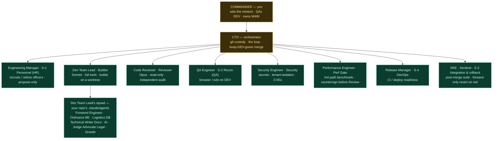
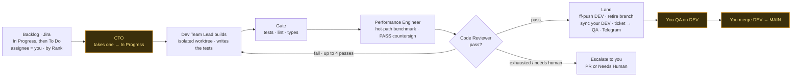
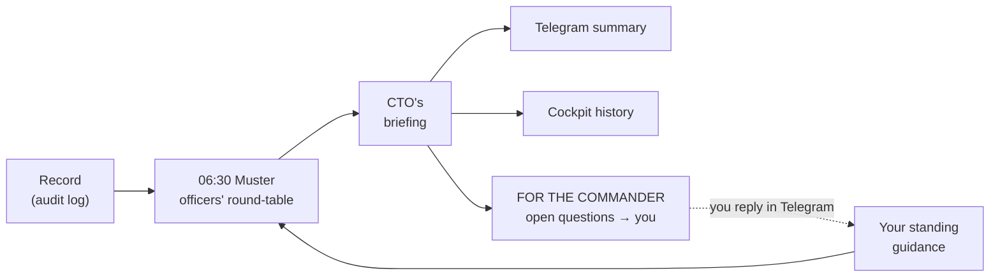

# The Elite Unit — chain of command, mission flow & daily council

An elite autonomous software unit. The CTO commands the officers; the officers build,
verify, train, and manage the corps; and every morning they muster, study their record, and
brief the Commander. Officers are text files (`officers/*.md`) in Identity / Knowledge /
Skills form — sharpen the file, sharpen the officer.

> Legend: **solid = active today** (code fills the post), _dashed = planned_. Army terminology;
> every officer must earn its post.

## Chain of command



**Build vs. check (no one signs off their own bridge):** officers that *build* live inside the
Dev Team Lead (the FE/BE/DB/AI squad). Officers that *independently verify* — Code
Reviewer, QA Engineer & Security Engineer — are separate and read-only. Defense in depth. The
**Engineering Manager** changes the *composition* of the corps (hire/retire). (The Engineering
Coach post was retired 2026-07-17, EU-327 — its load-bearing pieces live on in `signals.py` and
`doctrine.py`; officer-charter upkeep folded into the Engineering Manager's personnel pass.)

**Ranks & chain of recruitment.** Commander → CTO → **major officers** (sit on the council)
→ **junior officers / sub-leads** → **engineers**. A major may recruit its own engineers (its
`.claude/agents` squad) and, when a focus area needs its own leadership, junior officers who are
handed engineers for sub-tasks — **every hire is gated by the Engineering Manager's (HR) approval**. Standing
up a new *major* officer needs the CTO's call and your sign-off. Only majors sit on the daily
council; everyone below reports up the chain.

## Mission flow (one ticket)



## Daily council (the unit studies every day)

At **06:30** the officers muster: each gives a short SITREP from its lens on the unit's recent
record, the Engineering Manager covers personnel, and
the CTO chairs — producing a briefing, the day's orders, and the questions only you can
answer. The unit can also call an **ad-hoc muster** to work a specific improvement
(`general council --topic "…"`).

Only the **major officers** sit on the council — the squads do not attend; each major consults
and reports for its own engineers, keeping the muster sharp. The unit solves its own technical
and process problems and escalates to you **only** for genuinely Commander-level calls (product
direction, business strategy, irreversible decisions). Most mornings, that's *None*.



Run it: `general council` (now) · scheduled daily 06:30 via the server crontab (`scripts/install-server-cron.sh`)
· from your phone with `/council` · transcripts + history in the cockpit at `/council`.

## Roster

| Officer | Codename | Role | Status | Defined in |
|---|---|---|---|---|
| CTO | — | Orchestrator: git, the loop, the merge | **active** | `orchestrator/` |
| Engineering Manager | S-1 | Personnel (HR): recruit / retire officers — propose-only, from its council seat | **active** | `officers/adjutant.md`, `council.py` |
| Dev Team Lead | Builder | Implements the ticket on a worktree, writing the tests against the plan's acceptance criteria | **active** | `officers/engineer.md`, `builder.py` |
| Performance Engineer | Perf Gate | Hot-path benchmark gate before Reviewer: profiler trace or before/after wall-clock on hot paths; countersign required | **active** | `officers/performance-engineer.md` |
| Code Reviewer | Reviewer | Independent read-only spec + quality audit | **active** | `officers/inspector.md`, `reviewer.py` |
| QA Engineer | S-2 | Browser / e2e smoke on DEV (flows + a11y) | **active** | `officers/scout.md`, `scout.py` |
| Security Engineer | — | Security: secrets, tenant-isolation, authz, CVEs | **active** | `officers/provost.md`, `provost.py` |
| Release Manager | S-4 | CI / deploy readiness (build, migrations, env) | **active** | `officers/quartermaster.md`, `quartermaster.py` |
| SRE | S-3 | Post-merge integration & rollback on DEV: heavier post-merge suite (e2e/integration) on the landed base; forward-only revert + hand-back on red | **active** | `officers/sentinel.md`, `sentinel.py` |

**Retired posts.** The **Test Engineer** (a separate coverage gate between Gate and Review) was retired
by `c276155` — the Planner now hands the Dev Team Lead testable acceptance criteria, the Dev Team Lead
writes the tests, and the deterministic gate runs them. The **Engineering Coach** (daily drill /
charter upkeep) was retired 2026-07-17 (EU-327): EU-323 moved its signals helpers to `signals.py`,
EU-331 moved `snapshot_doctrine` to `doctrine.py`, leaving `drill()`/`apply()` with zero callers. An officer is **active** here when *code* fills
the post, which is not the same as owning a module: EU-325 (`4bf4fe2`) deleted `adjutant.py` (the
`general adjutant` CLI), but the Engineering Manager still sits on the daily council, so it stays.
`tests/eu260_org_reality_test.py` fails if this table cites a file that no longer exists.

## Jira lifecycle (a ticket's path)

```
To Do ──(CTO picks it up)──▶ In Progress ──(green merge to DEV)──▶ QA ──(your sign-off)──▶ Done
                                      ▲                                   │
                                      └──────────(you send it back)───────┘
```

Queue order when draining: **In Progress first** (resume), then **To Do top-to-bottom** by
board Rank, only tickets **assigned to you**.

## Adding an officer (the 15-minute method)

1. Describe how you do the task and what "good" looks like.
2. Turn it into `Identity / Knowledge / Skills` with `officers/_TEMPLATE.md`.
3. Drop a build-specialist in your repo's `.claude/agents/<name>.md`; a verifier gets its own
   `officers/<name>.md` and a hook in the loop.
4. Manage it — review its work; the Engineering Manager refines the file and decides whether
   it stays in post.
