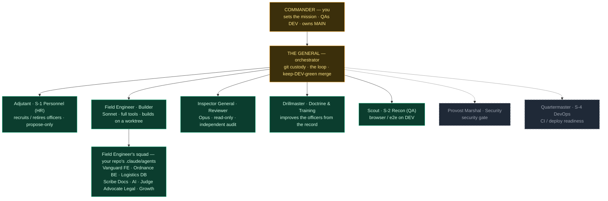
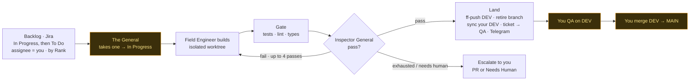
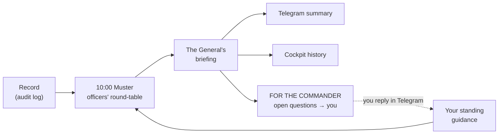

# The Elite Unit — chain of command, mission flow & daily council

An elite autonomous software unit. The General commands the officers; the officers build,
verify, train, and manage the corps; and every morning they muster, study their record, and
brief the Commander. Officers are text files (`officers/*.md`) in Identity / Knowledge /
Skills form — sharpen the file, sharpen the officer.

> Legend: **solid = active today**, _dashed = planned_. Army terminology; every officer must
> earn its post.

## Chain of command



**Build vs. check (no one signs off their own bridge):** officers that *build* live inside the
Field Engineer (the FE/BE/DB/AI squad). Officers that *independently verify* — Inspector
General, and the planned Scout & Provost — are separate and read-only. Defense in depth. The
**Adjutant** changes the *composition* of the corps (hire/retire); the **Drillmaster** sharpens
the officers already in post.

**Ranks & chain of recruitment.** Commander → General → **major officers** (sit on the council)
→ **junior officers / sub-leads** → **soldiers**. A major may recruit its own soldiers (its
`.claude/agents` squad) and, when a focus area needs its own leadership, junior officers who are
handed soldiers for sub-tasks — **every hire is gated by the Adjutant's (HR) approval**. Standing
up a new *major* officer needs the General's call and your sign-off. Only majors sit on the daily
council; everyone below reports up the chain.

## Mission flow (one ticket)



## Daily council (the unit studies every day)

At **10:00** the officers muster: each gives a short SITREP from its lens on the unit's recent
record, the Drillmaster names the one drill worth running, the Adjutant covers personnel, and
the General chairs — producing a briefing, the day's orders, and the questions only you can
answer. The unit can also call an **ad-hoc muster** to work a specific improvement
(`general council --topic "…"`).

Only the **major officers** sit on the council — the squads do not attend; each major consults
and reports for its own soldiers, keeping the muster sharp. The unit solves its own technical
and process problems and escalates to you **only** for genuinely Commander-level calls (product
direction, business strategy, irreversible decisions). Most mornings, that's *None*.



Run it: `general council` (now) · scheduled 10:00 via `scripts/com.roman.general.council.plist`
· from your phone with `/council` · transcripts + history in the cockpit at `/council`.

## Roster

| Officer | Codename | Role | Status | Defined in |
|---|---|---|---|---|
| The General | — | Orchestrator: git, the loop, the merge | **active** | `orchestrator/` |
| Adjutant | S-1 | Personnel (HR): recruit / retire officers | **active** | `officers/adjutant.md`, `adjutant.py` |
| Field Engineer | Builder | Implements the ticket on a worktree | **active** | `officers/engineer.md`, `builder.py` |
| Inspector General | Reviewer | Independent read-only spec + quality audit | **active** | `officers/inspector.md`, `reviewer.py` |
| Drillmaster | Doctrine | Reviews the record, proposes officer upgrades | **active** | `officers/drillmaster.md`, `drillmaster.py` |
| Scout | S-2 | Browser / e2e smoke on DEV (flows + a11y) | **active** | `officers/scout.md`, `scout.py` |
| Provost Marshal | — | Security gate before merge | _planned_ | — |
| Quartermaster | S-4 | CI / deploy readiness | _planned_ | — |

## Jira lifecycle (a ticket's path)

```
To Do ──(General picks it up)──▶ In Progress ──(green merge to DEV)──▶ QA ──(your sign-off)──▶ Done
                                      ▲                                   │
                                      └──────────(you send it back)───────┘
```

Queue order when draining: **In Progress first** (resume), then **To Do top-to-bottom** by
board Rank, only tickets **assigned to you**.

## Adding an officer (the 15-minute method)

1. Describe how you do the task and what "good" looks like.
2. Turn it into `Identity / Knowledge / Skills` with `officers/_TEMPLATE.md`.
3. Drop a build-specialist in your repo's `.claude/agents/<name>.md`; a verifier gets its own
   `officers/<name>.md` and a hook in the loop.
4. Manage it — review its work; the Drillmaster refines the file, the Adjutant decides whether
   it stays in post.
