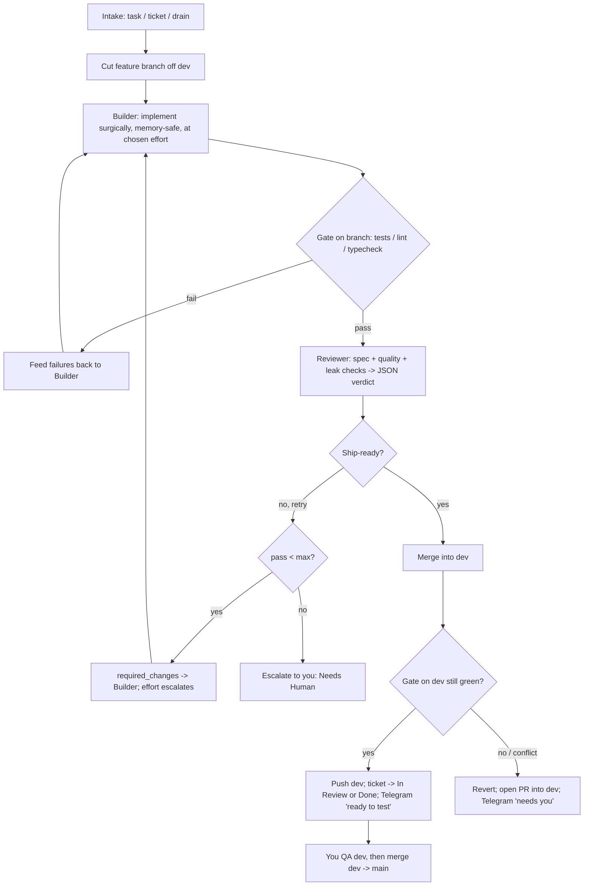

# The General — Technical Design

An unattended software-development unit. You are the **Commander**: you give orders
(tickets or plain-text tasks). The **General** (an orchestrator that runs on your Mac)
directs two AI **officers** — a **Builder** and a **Reviewer** — to implement each order
on a feature branch, verify it, and land it on the app's `dev` branch only when it's
green. You remain the only one who merges `dev → main`, after your QA.

This document describes how it works today and what's planned.

---

## 1. Philosophy

- **You command; the unit executes.** You should not have to babysit every step. You
  set the work and approve the final merge to `main`.
- **Generator–critic separation.** The Builder writes code; an independent, read-only
  Reviewer judges it. The Builder never grades its own work.
- **The ticket is the source of truth.** Every pass re-anchors on the ticket and its
  acceptance criteria, so the loop can't drift.
- **The diff is the unit of review.** "What changed" is always `git diff`, never prose.
- **Transparent and bounded.** Every action is logged; loops and resources are capped;
  `main` is physically protected.

---

## 2. Chain of command

| Role | Who / what | Powers |
|------|-----------|--------|
| Commander | You (Roman) | Give tickets/tasks; QA `dev`; merge `dev → main` |
| General | The orchestrator (`orchestrator/`) | Owns git, the Definition of Done, iteration/cost bounds, every Jira transition, the keep-green merge, notifications, logging |
| Builder (officer) | Claude Code via the Agent SDK, full tools | Locates code, implements the smallest correct change, runs scoped checks |
| Reviewer (officer) | A second Claude, **read-only** | Judges the diff on spec conformance + quality; returns the next order on failure |
| Role sub-agents *(planned)* | QA / Frontend / Backend / DevOps / Security / Database / Docs | The Builder delegates sub-tasks to the matching specialist; logged per task |
| QA officer *(planned)* | Claude Code + headless browser (Playwright) | Runs smoke/e2e/visual checks on `dev`, feeds failures back |

The Builder↔Reviewer exchange already behaves like two colleagues: the Reviewer's
required changes become the Builder's next prompt.

---

## 3. Where it runs (and what it is not)

The General runs **on your Mac**, because the three things it needs all live there: the
**Claude Code engine** (bundled with the Agent SDK), your **Max-plan login**, and your
**app repositories**. It is a command-line program plus a local web cockpit — not a cloud
service, and not the Cowork chat (which is an interactive assistant, not a 24/7 daemon).

**Authentication.** The officers use your Claude Code login. On a Max/Pro plan you run
`claude` → `/login` once (or `claude setup-token` → `CLAUDE_CODE_OAUTH_TOKEN` for
headless). Usage draws from your subscription's Agent-SDK allowance — there is **no
per-token dollar charge**. Setting `ANTHROPIC_API_KEY` overrides this and switches to
paid API billing, so it is left unset on Max.

---

## 4. The development loop

For each order:



`main` never appears as a write target — by design.

---

## 5. Intake modes

`intake.py` turns an order into a worklist of `(app, ticket)` pairs:

- **task** — free text (or a `--spec-file`) → an *ephemeral* ticket (no tracker, no Jira
  credentials needed). For quick bugs/features.
- **ticket** — one or more Jira keys → fetched via the backlog adapter.
- **drain** — pulls ready tickets from Jira: `status = To Do AND assignee = currentUser()`
  (only tickets assigned to you), up to `max_tickets_per_run`.

Ephemeral tickets skip all Jira writes; everything else updates the ticket.

---

## 6. Branching and the keep-green merge

- Each order gets its own branch off `dev`: `autodev/<ticket-or-slug>`.
- On a passing review the General commits, pushes the branch, then **merges into `dev`
  and re-runs the gate on `dev`**:
  - green → push `dev`; the ticket enters your QA queue.
  - red or merge conflict → the merge is **reverted locally** (so `dev` is never pushed
    broken) and a **PR into `dev`** is opened for you instead.
- `main` is protected at the code level: `git_ops` refuses to checkout, commit, push, or
  merge into the protected branch. You merge `dev → main` after QA.
- Between tickets the working tree is reset to a clean `dev` (`reset --hard` + `clean -fd`),
  so one order can't pollute the next. A run refuses to start on a dirty tree.

---

## 7. Jira integration

- **Selection:** `only_mine: true` adds `assignee = currentUser()`; `ready_status`
  (default "To Do") + optional label filter.
- **Status flow:** `To Do → In Progress` at start; on a successful merge to `dev` either
  `→ Done` (if `mark_done_on_merge: true`) or it stays `In Progress` for your manual QA
  (default). Escalations move to a "Needs Human" status (configurable).
- **status_map** maps the General's logical states to your board's actual status names.
- Acceptance criteria are read from a custom field or an "Acceptance Criteria" section of
  the description. (Tickets whose spec lives in a linked Google Doc only expose the link —
  put the spec in the ticket, or use `task --spec-file`.)

---

## 8. Effort control

- Per-run **effort** for each officer: `low | medium | high | max` (`builder_effort`,
  `reviewer_effort`), overridable with `--effort`.
- **Escalation on retry:** when a pass is rejected, the Builder's effort steps up one
  level (e.g. high → max) for the next attempt — spend more thinking after a rejection.
- The effort used is shown in the live progress line and logged per pass.

---

## 9. Memory & resource safety

The Builder is instructed to work surgically and to **never run the full test suite at
default concurrency** (Vitest spawns one worker per CPU core and can exhaust RAM — this
once froze the dev machine). It runs only the tests for files it changed, with bounded
workers (`--pool=forks --poolOptions.forks.maxForks=2`), prefers `tsc`/lint, and never
starts watch mode or dev servers.

The verification gate runs with per-app `gate_env` (e.g. `NODE_OPTIONS=--max-old-space-size=3072`)
so tests can't balloon. A standalone helper, `scripts/measure-vitest-mem.sh`, reports the
true peak memory across all Vitest processes for tuning.

---

## 10. Review: contract and checks

The Reviewer is read-only at the permission layer (`disallowed_tools` covers every
mutating tool) and judges on two axes — **spec conformance** and **quality** (architecture,
correctness, security, edge cases, tests, consistency, **regressions, scope creep, and
resource/memory leaks**). It returns strict JSON:

```json
{ "verdict": "PASS" | "FAIL",
  "spec_conformance": { "met": true, "gaps": ["..."] },
  "quality": { "issues": [ {"severity":"blocker|major|minor","area":"...","detail":"..."} ] },
  "required_changes": ["concrete next instruction for the Builder if FAIL"],
  "summary": "one-paragraph rationale" }
```

**Ship-ready** ⇔ `verdict == PASS` AND `spec_conformance.met` AND no blocker/major issues.
Anything else is a FAIL, and `required_changes` becomes the Builder's next prompt.

---

## 11. Verification gate

`gate.py` runs the app's own `gate_commands` (tests/lint/typecheck) — first on the feature
branch (a cheap filter before the costly review) and again on `dev` after a merge (to keep
`dev` green). Timeouts and `gate_env` are honored; a timeout counts as a failure.

---

## 12. Notifications (Telegram)

`notify.py` sends a message on every meaningful transition: **started**, **ready for
manual test on dev** (merged), **needs you** (PR/couldn't merge), **escalated**, and
**errored** — plus the Jira status changes. Dry-runs are prefixed `[DRY-RUN]`. Configured
via `TELEGRAM_BOT_TOKEN` + `TELEGRAM_CHAT_ID`; if unset, notifications are a safe no-op.
`./general ping` tests the wiring.

---

## 13. Monitoring: audit log, dashboard, control panel

- **Audit log** (`audit.jsonl`): append-only JSONL of every event (ticket start, each
  build with effort/turns/tools/summary, each gate, each review with verdict/feedback/
  issues, merge/PR/escalation), each timestamped — the system of record.
- **Dashboard** (`general dashboard`): a self-contained `dashboard.html` built from the
  audit log. Summary cards, a **"Needs your attention"** panel, and a table where **each
  row expands** into the per-task transcript: every pass's effort, the Builder's tool calls
  and summary, and the Reviewer's verdict + exactly what it asked for. `general status`
  gives the same as a terminal table.
- **Control panel** (`general serve`): a localhost-only web app (Flask) that serves the
  dashboard plus a control bar — pick an app, choose **task / ticket / drain**, set effort,
  toggle **live**, and press **Run** to launch work in the background. This is the cockpit:
  start work with a button, watch results, drill into transcripts.

Cost figures are hidden on Max (they are API-rate estimates, not charges).

---

## 14. Safety & security model

- **Dry-run by default** — the full loop runs (including a *trial* merge to predict
  whether `dev` would stay green) with no push, no merge, no Jira/Telegram writes.
- **`main` is code-protected** — the General cannot operate on the protected branch.
- **Reviewer is read-only** — enforced at the permission layer, not by prompt.
- **Bounded** — `max_iterations` per ticket; a `max_cost_usd` budget (disabled on Max,
  where `max_tickets_per_run` is the real cap).
- **Clean-tree guarantee** — refuses to start dirty; resets between tickets.
- **Secrets** come from the environment only, never config or code.
- **Audit trail** for replay and review.
- *Planned:* a dedicated security-review role sub-agent and dependency/secret scanning in
  the gate.

---

## 15. Data contracts (`contracts.py`)

| Type | Purpose |
|------|---------|
| `Ticket` | Unit of work (id, summary, description, acceptance_criteria, app, ephemeral) |
| `BuildRequest` | Order to the Builder (ticket, branch, prior_issues, iteration) |
| `BuildResult` | Builder output (ok, summary, cost, turns, tools) |
| `GateResult` | Gate pass/fail + report |
| `ReviewResult` | Verdict, spec gaps, quality issues, required_changes, summary |
| `TicketReport` | Final per-task outcome (app, branch, pr_url, iterations, notes) |

**Outcomes:** `merged_to_dev`, `pr_into_dev`, `escalated`, `errored`, `skipped` (dry-run).

---

## 16. Configuration

Global keys: `builder_model`, `reviewer_model`, `builder_effort`, `reviewer_effort`,
`escalate_effort_on_retry`, `max_iterations`, `max_cost_usd` (0 = no cap),
`max_tickets_per_run`, `merge_to_dev`, `open_pr_on_block`, `mark_done_on_merge`,
`dry_run`, `audit_path`, and `apps[]`.

Per-app keys: `name`, `repo_path`, `base_branch` (dev), `protected_branch` (main),
`branch_prefix`, `gate_commands`, `gate_timeout_sec`, `gate_env`, `backlog_backend`
(`jira` | `notion` | `none`), and a `backlog` block (`base_url`, `project_key`,
`ready_status`, `only_mine`, `require_label`, `label`, `jql`,
`acceptance_criteria_field`, `status_map`).

Environment: Claude auth (Max login or `CLAUDE_CODE_OAUTH_TOKEN`, or `ANTHROPIC_API_KEY`
for API billing); `JIRA_EMAIL` + `JIRA_API_TOKEN`; `TELEGRAM_BOT_TOKEN` + `TELEGRAM_CHAT_ID`.

---

## 17. CLI reference

```
general doctor                         # preflight: config, auth, repos, branches, tooling
general ping                           # test Telegram
general task <app> "<text>" [--ac ...] # free-text order (or --spec-file <path>)
general ticket <app> KEY [KEY ...]     # work specific Jira tickets
general drain [app]                    # work your assigned To-Do tickets
general dashboard [--open]             # build dashboard.html from the audit log
general status                         # quick task table in the terminal
general serve [--port 8787]            # the control panel web app
```

Global flags: `--config`, `--live` (disable dry-run), `--max-tickets`, `--max-iterations`,
`--effort`.

---

## 18. Component map

| File | Responsibility |
|------|----------------|
| `main.py` | CLI: task / ticket / drain / doctor / ping / dashboard / status / serve |
| `loop.py` | The state machine: build → gate → review → land / retry / escalate; cleanup |
| `builder.py` | Builder officer (full tools, effort, memory-safe prompt) |
| `reviewer.py` | Reviewer officer (read-only, JSON verdict) |
| `agent.py` | Shared Agent SDK runner; streams + captures tool calls |
| `gate.py` | Runs an app's tests/lint (branch, then dev) with `gate_env` |
| `git_ops.py` | Branch / diff / keep-green merge / PR; protects `main` |
| `intake.py` | task / ticket / drain → worklist |
| `contracts.py` | Hand-off dataclasses |
| `config.py` | Apps + global settings; auth detection |
| `audit.py` | JSONL audit log |
| `notify.py` | Telegram notifications |
| `dashboard.py` | Builds the cockpit HTML + terminal status from the audit log |
| `server.py` | Control panel web app (`general serve`) |
| `backlog/` | `base` interface, `jira` (primary), `notion` (stub), `none` |

---

## 19. Roadmap

1. **Role sub-agents** — QA / Frontend / Backend / DevOps / Security / Database / Docs as
   Claude Code sub-agents. The commander engages the relevant specialists per task
   (driven by each role's description), and the dashboard logs which roles were used.
2. **Hybrid QA officer** — Claude Code + Playwright running smoke/e2e/visual checks on
   `dev` inside the loop, feeding failures back to the Builder; your final check before
   `main` remains.
3. **Control-panel polish** — live auto-refresh and per-stage timings.
4. **Security hardening** — security-review role + dependency/secret scanning in the gate.

---

## 20. Constraints & assumptions

- Runs on the developer's Mac (Claude Code, login, and repos are all local). It is not a
  hosted service.
- Real regression *proof* requires a test gate; the read-only Reviewer reasons about
  regressions but cannot run the suite itself.
- Multi-app runs are sequential per repo (one branch checked out at a time per repo).
- Subscription runs report cost as ~$0 (no per-token invoice); `max_tickets_per_run` and
  `max_iterations` are the effective limits there.
