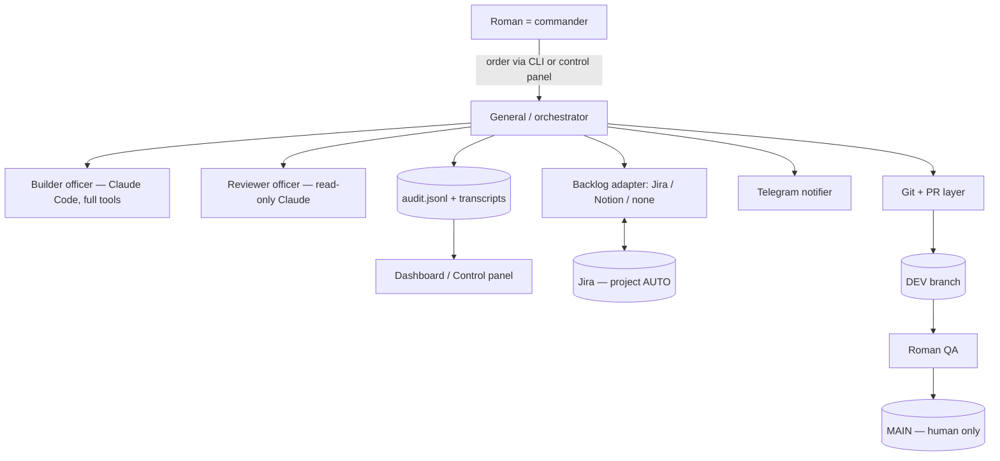
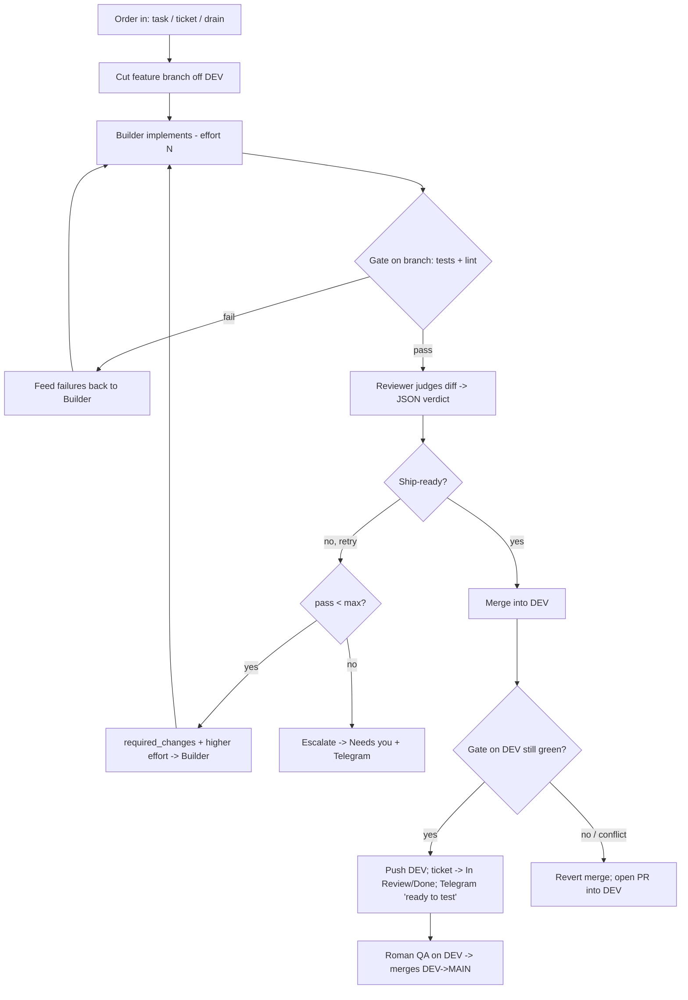

# The General — Technical Design

**Status:** working system (single-app and multi-app), under active extension.
**Owner:** Roman Berlin. **Runs on:** Roman's Mac (Claude Code + Max plan).
**Purpose:** an autonomous software-development unit that implements tickets and
bug-fixes across Roman's SaaS apps, lands passing work on each app's `DEV` branch,
and reports through a control-panel cockpit — so one founder can ship like a team.

> Legend: sections marked **(PLANNED)** are designed but not yet built.

---

## 1. Concept & chain of command

A small army runs the software. **You are the Commander.** You issue orders (a free-text
task, a Jira ticket, or a whole queue) and you alone promote work to production. The
**General** is your orchestrator: it commands the officers, owns the operation plan and
the chain of custody, and reports to you.

### Chain of command

```
COMMANDER (you)
   └── THE GENERAL  (orchestrator)
        ├── Engineer        (Builder)    — builds the works on a field branch
        ├── Inspector       (Reviewer)   — independent, read-only audit of the work
        ├── Scout           (QA)         — field-tests the app on DEV            (PLANNED)
        ├── Provost         (Security)   — security review & gate                (PLANNED)
        └── Quartermaster   (DevOps)     — CI / build / deploy-readiness         (PLANNED)
                 └── Engineer's specialist corps (sub-agents dispatched per mission):
                       Vanguard (Frontend) · Ordnance (Backend) ·
                       Logistics (Database) · Scribe (Docs)                       (PLANNED)
```

### Officer roster

| Officer (rank) | Code name | Mission | Status |
|---|---|---|---|
| **The General** | orchestrator | Runs the loop, owns the plan, the merge, the audit trail | Built |
| **Engineer** | Builder | Claude Code, full tools; builds the smallest correct change on `autodev/<id>` | Built |
| **Inspector** | Reviewer | Read-only second Claude; audits the diff on spec + quality | Built |
| **Drillmaster** | Trainer | Reads the unit's record + officer files; proposes instruction upgrades (you approve) | Built |
| **Scout** | QA officer | Headless-browser e2e / visual checks on `DEV`, reports failures back | PLANNED |
| **Provost** | Security | Secrets / injection / authz / dependency review; can block a merge | PLANNED |
| **Quartermaster** | DevOps | CI status, build health, deploy readiness, environment | PLANNED |
| **Vanguard / Ordnance / Logistics / Scribe** | FE / BE / DB / Docs sub-agents | The Engineer dispatches the right specialists per mission | PLANNED |
| **Chief of Staff** | Planner | Breaks an order into tickets, picks which officers to engage, sets effort | PLANNED (recommended) |
| **Designer** | UX officer | Reviews / produces UI-UX; guards design quality | PLANNED (recommended) |

The General runs the officers in a loop until the work passes the Inspector and lands on
`DEV`. You do the final QA on `DEV` and are the only one who merges to `MAIN`.

The design principle is **generator–critic separation**: the Builder is biased toward
"make it work" and must not grade its own homework; the Reviewer has fresh eyes and a
read-only sandbox so it cannot rationalise a change by editing it. The failure mode
being engineered against is the **telephone game** (lossy hand-offs + drift), countered
by three rules: the ticket is the source of truth (not chat); the `git diff` is the unit
of review; hand-offs are structured packets, not free text.

## 2. Goals / Non-goals

**Goals:** autonomous feature + bug delivery; human-gated promotion to production; full
transparency (who/what/effort per task); memory-safe and cost-safe on a Max plan; a
single cockpit to launch and monitor everything.

**Non-goals:** the General never deploys to production or merges `MAIN`; it is not a CI
server (it complements CI); it does not run unattended without the user's machine on.

## 3. Architecture



**Components (Python package `orchestrator/`):**

| Module | Responsibility |
|---|---|
| `main.py` | CLI: `task / ticket / drain / dashboard / status / serve / doctor / ping` |
| `loop.py` | Core loop: build → gate → review → land-on-DEV / retry / escalate |
| `builder.py` | Builder driver (Agent SDK, full tools, effort, memory-safe prompt) |
| `reviewer.py` | Reviewer driver (read-only, structured JSON verdict) |
| `agent.py` | Shared Agent-SDK runner; streams + captures tool calls |
| `gate.py` | Runs the app's tests/lint (on branch, and again on DEV) |
| `git_ops.py` | Branch / diff / keep-green merge / PR; protects `MAIN` |
| `intake.py` | Turns an order into a worklist of `(app, ticket)` |
| `contracts.py` | Hand-off dataclasses |
| `config.py` | Apps + global settings + env secrets |
| `audit.py` | Append-only JSONL event log |
| `dashboard.py` | Renders cockpit HTML + terminal status from the audit log |
| `server.py` | Control-panel web app (`general serve`) |
| `notify.py` | Telegram notifications |
| `backlog/` | `base` interface, `jira` (primary), `notion` (stub), `none` |

## 4. The core loop



Per ticket the General: cuts `autodev/<id>` off `DEV`; runs the Builder; runs the gate on
the branch (cheap filter before review); hands the **diff** to the Reviewer; on a passing
verdict it merges into `DEV`, **re-runs the gate on DEV** (keep-green), and pushes if
green or reverts + opens a PR if not. Repeated failure escalates after `max_iterations`.

## 5. Roles & ranks

- **Engineer (Builder)** — `ClaudeAgentOptions(permission_mode="acceptEdits",
  allowed_tools=[Read,Write,Edit,Bash,Glob,Grep], effort=…)`. Works surgically: locate →
  minimal plan → smallest change → narrow tests, and **never runs the full test suite at
  default concurrency** (memory safety — see §11).
- **Inspector (Reviewer)** — read-only at the permission layer (`disallowed_tools=[Write,
  Edit,NotebookEdit,Bash]`). Audits spec conformance **and** quality (architecture,
  security, edge cases, tests, **regressions, scope creep, resource/memory leaks**) and
  returns a strict JSON verdict. An Inspector General that cannot touch the works it
  inspects.
- **Engineer's specialist corps (PLANNED)** — sub-agents defined via the SDK `agents`
  option: **Vanguard** (Frontend), **Ordnance** (Backend), **Logistics** (Database),
  **Scribe** (Docs), and shared specialists **Provost** (Security) / **Quartermaster**
  (DevOps). The Chief of Staff (or the Engineer) engages the relevant officers per mission
  — driven by each officer's description — and the cockpit logs which served.
- **Scout (QA officer, PLANNED, hybrid)** — a Claude Code agent with a headless browser
  (Playwright). Runs reconnaissance — smoke/e2e + visual checks on the app on `DEV` — and
  feeds failures back into the loop. You still do the final check before `MAIN`.
- **Chief of Staff (Planner, PLANNED)** — turns an order/epic into a tasked mission:
  splits it into tickets, selects which officers to engage, sets effort. Formalises
  "the commander picks the specialists per task".

**Build vs check — why this isn't duplication.** Officers that *build* (the Engineer and
its specialist corps — FE/BE/DB/Docs/DevOps) work toward the change and live *inside* the
Engineer as Claude Code sub-agents. Officers that *independently verify* (Inspector, Scout,
and Provost-as-a-gate) are *separate*, each with its own context and read-only access. Two
agents are only redundant if they check the same thing the same way; the value here is the
**independence** — the bridge-builders never sign off their own bridge. This is defense in
depth, not repetition.

## 6. Branch & merge model

`feature → DEV (auto, keep-green) → human QA → MAIN (human only)`. `MAIN` (the
`protected_branch`) is code-blocked: `git_ops` refuses to checkout/commit/merge it. A
merge into `DEV` that fails the DEV gate is reverted locally (DEV is never pushed broken)
and turned into a PR. Branch names: `autodev/<TICKET-slug>` (Jira) or `autodev/adhoc-…`
(free-text).

## 7. Intake

| Mode | Command | Behaviour |
|---|---|---|
| Free text | `task <app> "…"` or `--spec-file <f>` `--ac` | Ad-hoc *ephemeral* ticket; no tracker; no Jira creds needed |
| Ticket(s) | `ticket <app> AUTO-1 AUTO-2 …` | Fetches each Jira issue by key |
| Drain | `drain [app]` | Pulls ready tickets: `status = To Do AND assignee = currentUser()` |

Ephemeral tickets skip all backlog writes. Jira drain is filtered to **tickets assigned
to Roman** by default (`only_mine: true`).

## 8. Effort control

`effort ∈ {low, medium, high, max}` for Builder and Reviewer (maps to the model's
thinking depth). When a pass is rejected, the Builder's effort **auto-escalates** one
level on the next pass (spend more thinking after a rejection), capped at `max`.
Overridable per run with `--effort`.

## 9. Data contracts

**Reviewer verdict (strict JSON the Reviewer must emit):**
```json
{
  "verdict": "PASS | FAIL",
  "spec_conformance": { "met": true, "gaps": ["…"] },
  "quality": { "issues": [ {"severity":"blocker|major|minor","area":"…","detail":"…"} ] },
  "required_changes": ["concrete instruction for the Builder if FAIL"],
  "summary": "one-paragraph rationale"
}
```
Ship-ready ⇔ `verdict == PASS` AND `spec_conformance.met` AND no blocker/major issues.

**Outcomes:** `merged_to_dev`, `pr_into_dev`, `escalated`, `errored`, `skipped` (dry-run).

## 10. Verification gate

Per-app `gate_commands` (e.g. lint, typecheck, a memory-bounded test command) run on the
feature branch before review and again on `DEV` after merge. `gate_env` injects
environment (e.g. `NODE_OPTIONS=--max-old-space-size=3072`) so tests can't exhaust RAM.

## 11. Memory safety

Vitest defaults to one worker per CPU core (~14 on an M-series Pro), each holding heavy
module imports — tens of GB, enough to freeze the machine. Mitigations: the Builder is
instructed to run **only the touched test files with capped workers**
(`--pool=forks --poolOptions.forks.maxForks=2`) and never watch mode; the gate uses
`gate_env` caps; role sub-agent parallelism (PLANNED) will be capped.

## 12. Transparency & telemetry

Every step is appended to `audit.jsonl` (timestamp, event, ticket, app, iteration,
effort, turns, cost, verdict, the Builder's **tool calls**, the Reviewer's **summary +
required_changes + issues**, diff hash). From this the system renders:

- **`general dashboard`** → a self-contained `dashboard.html`: summary cards, a
  **"Needs your attention"** panel, and a table whose rows **expand into the full
  per-pass transcript** (effort, Builder tools + summary, Reviewer verdict + feedback).
- **`general status`** → a quick terminal table.
- **`general serve`** → the **control panel**: the dashboard plus a control bar (app,
  mode, effort, live toggle, **Run** button) that launches runs in a background thread.
  Localhost-only.

## 13. Notifications

Telegram messages on each stage: started, **ready for manual test on DEV**, needs-you
(PR), escalated, errored — plus **critical-issue** and **decision-needed** alerts, and a
verbose mode (implemented / verdict / pushed). Jira status transitions mirror these.
Configured via `TELEGRAM_BOT_TOKEN` / `TELEGRAM_CHAT_ID`; `general ping` tests it. Dry-runs
are prefixed `[DRY-RUN]`.

**Two-way decisions** — when the Inspector flags `needs_human`, the ticket pauses and you
get the question; reply in Telegram (`AUTO-1: <decision>`) and the control panel's listener
**resumes the ticket** with your answer baked into the spec.

**Rituals & continuous improvement** — `general standup` (daily report: shipped / needs-you
/ awaiting-decision) and `general drill` (the **Drillmaster** reads the audit + the
`officers/*.md` Identity/Knowledge/Skills files and proposes precise instruction upgrades
for your approval — the team compounds).

## 14. Configuration

`config.yaml` (behaviour) + `.env` (secrets, never committed). Key global fields:
`builder_model`, `reviewer_model`, `builder_effort`, `reviewer_effort`,
`escalate_effort_on_retry`, `max_iterations`, `max_tickets_per_run`, `max_cost_usd`
(0 = off, for subscriptions), `merge_to_dev`, `open_pr_on_block`, `mark_done_on_merge`,
`dry_run`, `audit_path`. Per-app: `repo_path`, `base_branch`, `protected_branch`,
`branch_prefix`, `gate_commands`, `gate_env`, `backlog_backend`, `backlog{…}`.

## 15. Authentication & cost

The officers run on Claude Code, so they use Roman's **Max-plan login** (`claude /login`,
or `CLAUDE_CODE_OAUTH_TOKEN` for headless) — no API key, no per-token bill (usage draws
from the subscription's Agent-SDK allowance). `ANTHROPIC_API_KEY` must stay **unset** or
it would override the subscription and bill the API. Cost is therefore hidden in the UI
on a subscription.

## 16. Safety & security

- **`MAIN` is never touched** by the General; Roman merges it after QA.
- **Dry-run is the default**; a dry-run trial-merges locally and reverts, with no push /
  merge / Jira / Telegram side effects.
- **Reviewer is read-only** at the permission layer and explicitly checks security
  (injection, secrets, authz) and regressions.
- **Bounded**: `max_iterations` per ticket; `max_tickets_per_run`; optional cost cap.
- **Auditable**: every action in `audit.jsonl`.
- Secrets only from the environment; control panel bound to localhost.
- **(PLANNED)** dedicated Security role sub-agent; dependency/secret scanning; guardrails
  on destructive shell/FS operations during unattended runs.

## 17. Execution model

The General runs on Roman's Mac because that is where Claude Code, his login, and the app
repos live. He launches runs from the control panel (the "button") or the CLI; there is
no cron daemon by default (he chose to start runs himself and keep the queue stocked).
The Cowork chat is the architect/help-desk that builds and improves the General — it does
not run inside the loop.

## 18. Best practices applied

The General deliberately implements recognised agentic patterns rather than inventing its
own:

- **Reflection / generator–critic** — the Engineer generates, the Inspector critiques; the
  Inspector's `required_changes` drive the next attempt. This is the single most reliable
  quality lever in agentic coding.
- **Plan → Act → Reflect** — (PLANNED Chief of Staff) plans the mission, the Engineer
  acts, the Inspector reflects. Each loop re-anchors on the ticket, not on chat history.
- **Bounded autonomy (anti-"Ralph-loop" guards)** — autonomous loops are powerful but burn
  tokens and can thrash. We cap with `max_iterations`, `max_tickets_per_run`, an optional
  cost budget, and **effort escalation only on retry** — and escalate to a human instead
  of looping forever.
- **Human-in-the-loop at the milestone gate** — fully autonomous through
  build → test → review → land-on-`DEV`; the human steps in exactly where it matters: QA
  on `DEV` and the promotion to `MAIN`. (The recognised "agents handle retries/CI, humans
  step in at PR time" pattern.)
- **Auditable approval + observability** — every action is logged; the cockpit offers
  session-replay-style drill-down so you can rewind what each officer did and why.
- **Least privilege & sandboxing** — the Inspector is read-only; `MAIN` is code-blocked;
  secrets live only in the environment; the control panel binds to localhost.
- **Small, spec-driven diffs** — one ticket, the smallest correct change, narrow tests,
  judged against explicit acceptance criteria.

## 19. Cockpit UX/UI (design)

Goals: status-first, low cognitive load, progressive disclosure, and "beautiful" without
clutter. Grounded in 2026 agent-observability dashboard practice:

- **Real-time status / heartbeats** — every officer/task shows *working · idle · needs-you
  · done*; a "● run in progress" badge while busy. (PLANNED: auto-refresh + a live tool
  stream so you watch the Engineer act in real time.)
- **One unified cockpit** — task status, per-pass detail, and the work queue in a single
  view; no tab-hunting.
- **Progressive disclosure / "time travel"** — rows collapse to a one-line status and
  **expand into the full transcript** (each pass: effort, the Engineer's tool calls +
  summary, the Inspector's verdict + feedback). This is session replay — rewind to where a
  reasoning path diverged.
- **Actionable alerting** — a **"Needs your attention"** panel surfaces PR / escalated /
  errored items first; Telegram mirrors it. (PLANNED: thresholds, e.g. alert if >N
  escalations or a stuck run.)
- **Consistent semantics** — colour = state (green merged, amber needs-you/dry-run, red
  errored, muted running); rank colours for officers; tabular numerics for turns/effort.
- **Command surface** — the control bar (app · mode · effort · live · **Run**) sits atop
  the same view, so you command and observe in one place; localhost-only for safety.
- **Slicing (PLANNED)** — view effort/turns by app, by officer/role, and by mission, to
  see where time goes.

Design direction for the redesign: a calm dark theme, a left rail for officers/queues, a
center board of missions, a right rail for "needs you", and an inspector drawer for the
full transcript — keyboard-navigable, with each officer's rank colour used consistently.

## 20. Roadmap

1. **Commission the specialist corps** — Vanguard (FE) · Ordnance (BE) · Logistics (DB) ·
   Scribe (Docs) + Provost (Security) · Quartermaster (DevOps); engaged per mission and
   logged per role in the cockpit.
2. **Deploy the Scout (hybrid QA officer)** — Playwright browser/e2e + visual checks on
   `DEV` inside the loop.
3. **Commission the Chief of Staff (Planner)** — splits an order into tickets, selects the
   officers, sets effort.
4. **Commission the Designer (UX officer)** — design review + UI quality.
5. **Redesign the cockpit** — left rail (officers/queues), mission board, "needs you"
   rail, transcript drawer; auto-refresh + live tool-stream.
6. **Harden DEV custody** — run the green-check on a throwaway temp branch so `DEV` is
   never touched outside one validated, pushed merge.

## 21. Glossary

**Commander** = you (the human); sole authority to promote to `MAIN`.
**The General** = the orchestrator. **Officers** = the AI roles: **Engineer** (Builder),
**Inspector** (Reviewer), **Scout** (QA), **Provost** (Security), **Quartermaster**
(DevOps), **Vanguard / Ordnance / Logistics / Scribe** (FE / BE / DB / Docs), **Chief of
Staff** (Planner), **Designer** (UX). **Ephemeral ticket** = a free-text task with no
tracker entry. **Keep-green** = re-running the gate on `DEV` after a merge and reverting
if it breaks. **Ship-ready** = a verdict that passes spec + has no blocker/major issues.
